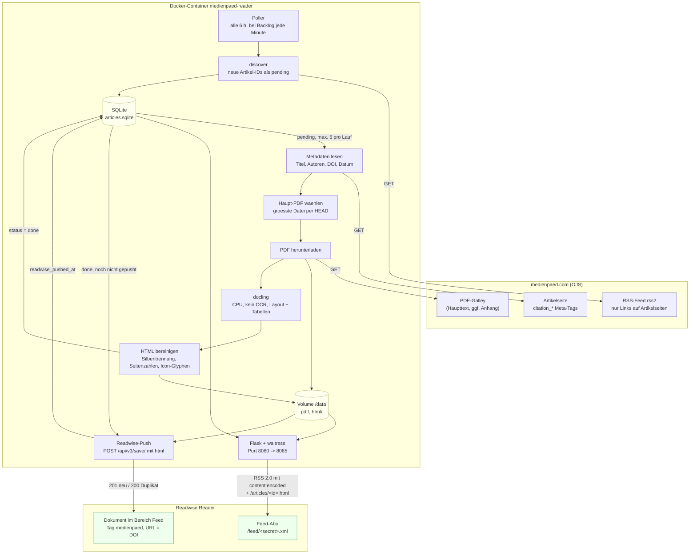

# medienpaed-reader

Volltext-Feed fuer die Zeitschrift [MedienPaedagogik](https://www.medienpaed.com/)
zum Lesen in Readwise Reader.

Der offizielle RSS-Feed verlinkt nur die Artikelseite, der Text steckt im PDF.
Dieser Dienst pollt den Feed, laedt das Haupt-PDF, wandelt es mit
[docling](https://github.com/docling-project/docling) in strukturiertes HTML um und
liefert einen eigenen RSS-Feed mit dem Volltext aus. Optional werden die Artikel
zusaetzlich direkt per Readwise-Reader-API angelegt.

Alle Beitraege der Zeitschrift stehen unter CC BY 4.0.

## Funktionsweise



Fehlerbehandlung: Jeder Artikel wird isoliert verarbeitet. Schlaegt ein Schritt fehl,
bleibt der Artikel pending und wird beim naechsten Lauf erneut versucht, nach
`MAX_ATTEMPTS` Versuchen wird er als failed markiert.

- Verarbeitete Artikel werden in SQLite (`DATA_DIR/articles.sqlite`) gefuehrt,
  PDFs und HTML liegen daneben.
- Bei mehreren PDF-Galleys (Haupttext + Anhang) wird die groesste Datei gewaehlt.
- Fehler werden pro Artikel isoliert, bis zu `MAX_ATTEMPTS` Versuche.
- Der Feed ist nur unter einem geheimen Pfadsegment erreichbar.

## Betrieb mit Docker

```bash
cp .env.example .env
# PUBLIC_BASE_URL und FEED_SECRET setzen (openssl rand -hex 16)
docker compose build
docker compose up -d
docker compose logs -f
```

Danach in Readwise Reader den Feed `https://<PUBLIC_BASE_URL>/feed/<FEED_SECRET>.xml`
abonnieren. Der Dienst gehoert hinter einen Reverse Proxy mit TLS.

Erststart: Der Dienst konvertiert die 20 aktuellen Feed-Eintraege
(`MAX_ARTICLES_PER_POLL` pro Durchlauf). Sollen Altartikel uebersprungen werden:

```bash
docker compose run --rm medienpaed-reader medienpaed-reader mark-known
```

Ressourcen: 2 CPU-Kerne und 4 GB RAM reichen. Ein Aufsatz mit 25 Seiten braucht
auf der CPU etwa eine Minute. Die docling-Modelle werden beim Image-Build geladen,
der Container braucht zur Laufzeit keinen Zugriff auf Hugging Face.

## Readwise-API-Push (optional)

```bash
READWISE_PUSH=true
READWISE_TOKEN=<Token von https://readwise.io/access_token>
READWISE_LOCATION=feed      # new | later | archive | feed
```

Artikel werden mit ihrem DOI als URL angelegt, Readwise erkennt Duplikate daran.
Manuell: `medienpaed-reader push-readwise --dry-run`.

## Lokale Entwicklung

```bash
uv sync
cp .env.example .env
uv run medienpaed-reader run-once --limit 1 -v
uv run medienpaed-reader serve --no-poll
curl localhost:8080/feed/<FEED_SECRET>.xml

uv run pytest
uv run ruff check src tests
uv run mypy src
```

## Kommandos

| Kommando | Zweck |
|---|---|
| `run-once [--limit N] [--skip-discover]` | Feed abfragen, neue Artikel konvertieren |
| `serve [--no-poll]` | Webserver, pollt im Hintergrund alle `POLL_INTERVAL_SECONDS` |
| `push-readwise [--dry-run]` | fertige Artikel an Readwise senden |
| `mark-known` | aktuelle Feed-Eintraege ueberspringen |

Alle Kommandos kennen `--verbose`, `--quiet` und `--data-dir`.

## Konfiguration

Siehe `.env.example`. Alle Werte kommen aus Umgebungsvariablen oder `.env`.
