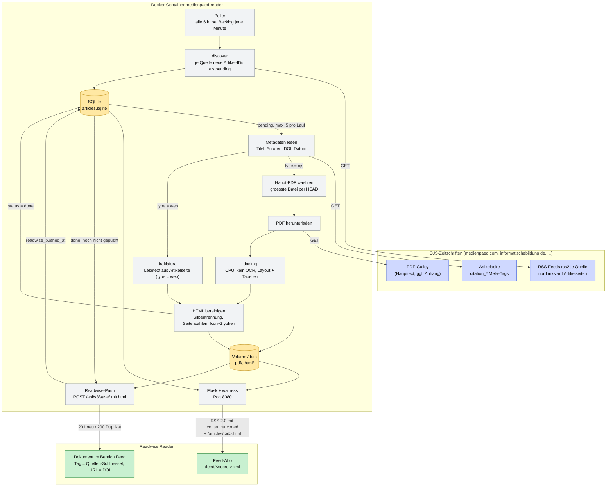

# medienpaed-reader

Volltext-Feeds fuer Open-Access-Zeitschriften auf OJS-Basis (Open Journal Systems)
zum Lesen in Readwise Reader. Vorkonfiguriert sind
[MedienPaedagogik](https://www.medienpaed.com/) und
[Informatische Bildung in Schulen (IBiS)](https://www.informatischebildung.de/index.php/ibis).

Die offiziellen RSS-Feeds verlinken nur die Artikelseite, der Text steckt im PDF.
Dieser Dienst pollt die Feeds, laedt das Haupt-PDF, wandelt es mit
[docling](https://github.com/docling-project/docling) in strukturiertes HTML um und
liefert einen eigenen RSS-Feed mit dem Volltext aus. Optional werden die Artikel
zusaetzlich direkt per Readwise-Reader-API angelegt.

Die Lizenz (z. B. CC BY 4.0, CC BY-NC 4.0) steht pro Quelle in `sources.toml` und
wird in jedem Volltext als Kopfzeile ausgewiesen.

## Quellen konfigurieren

`sources.toml`, eine Tabelle pro Zeitschrift. Der Tabellenname ist der stabile
Schluessel fuer Datenbank, Dateinamen, Feed-URL und Readwise-Tag:

```toml
[ibis]
name = "Informatische Bildung in Schulen (IBiS)"
feed_url = "https://www.informatischebildung.de/index.php/ibis/gateway/plugin/WebFeedGatewayPlugin/rss2"
homepage = "https://www.informatischebildung.de/index.php/ibis"
license = "CC BY-NC 4.0"
# readwise_tags = ["informatik"]   # Default: der Schluessel
# enabled = false
```

Jede OJS-Instanz mit dem WebFeed-Plugin und `citation_pdf_url`-Meta-Tags auf der
Artikelseite sollte ohne Codeaenderung funktionieren. Die Datei wird beim Start
gelesen; nach Aenderungen den Container neu starten (`docker compose restart`).

### Quellentyp `web`: Teaser-Feeds als Volltext

Viele Nachrichten- und Blog-Feeds liefern nur einen Anriss. Mit `type = "web"` laedt
der Dienst stattdessen die verlinkte Artikelseite und zieht den Lesetext mit
[trafilatura](https://trafilatura.readthedocs.io/) heraus, ohne PDF und docling:

```toml
[heise-mac-i]
type = "web"
name = "Mac & i"
feed_url = "https://www.heise.de/mac-and-i/feed.xml"
homepage = "https://www.heise.de/mac-and-i/"
license = "Alle Rechte beim Verlag, nur zum privaten Lesen"
```

Grenzen: Paywall-Inhalte und per JavaScript nachgeladene Texte kommen nicht mit.
Seiten mit weniger als 300 Zeichen Lesetext werden als Fehler gewertet und spaeter
erneut versucht. Als Kennung dient ein Hash der Artikel-URL.

Feeds:

| URL | Inhalt |
|---|---|
| `/feed/<FEED_SECRET>.xml` | alle Quellen, neueste zuerst |
| `/feed/<FEED_SECRET>/<schluessel>.xml` | nur eine Quelle |
| `/articles/<schluessel>/<id>.html` | Volltext-Seite eines Artikels |

## Funktionsweise



Fehlerbehandlung: Jeder Artikel wird isoliert verarbeitet. Schlaegt ein Schritt fehl,
bleibt der Artikel pending und wird beim naechsten Lauf erneut versucht, nach
`MAX_ATTEMPTS` Versuchen wird er als failed markiert.

- Verarbeitete Artikel werden in SQLite (`DATA_DIR/articles.sqlite`) gefuehrt,
  Schluessel ist (Quelle, Artikel-ID). PDFs und HTML liegen unter
  `DATA_DIR/pdf/<quelle>/` und `DATA_DIR/html/<quelle>/`.
- Bei mehreren PDF-Galleys (Haupttext + Anhang) wird die groesste Datei gewaehlt.
- Fehler werden pro Artikel isoliert, bis zu `MAX_ATTEMPTS` Versuche.
- Der Feed ist nur unter einem geheimen Pfadsegment erreichbar.

## Betrieb mit Docker

```bash
cp .env.example .env
# PUBLIC_BASE_URL und FEED_SECRET setzen (openssl rand -hex 16)
docker compose build
docker compose up -d
docker compose logs -f
```

Danach in Readwise Reader den Feed `https://<PUBLIC_BASE_URL>/feed/<FEED_SECRET>.xml`
abonnieren. Der Dienst gehoert hinter einen Reverse Proxy mit TLS.

Erststart: Der Dienst konvertiert die 20 aktuellen Feed-Eintraege
(`MAX_ARTICLES_PER_POLL` pro Durchlauf). Sollen Altartikel uebersprungen werden:

```bash
docker compose run --rm medienpaed-reader medienpaed-reader mark-known
```

Eine Datenbank aus Version 0.1 (nur medienpaed) wird beim ersten Start automatisch
auf das Schema mit Quellen-Schluessel migriert.

Ressourcen: 2 CPU-Kerne und 4 GB RAM reichen. Ein Aufsatz mit 25 Seiten braucht
auf der CPU etwa eine Minute. Die docling-Modelle werden beim Image-Build geladen,
der Container braucht zur Laufzeit keinen Zugriff auf Hugging Face.

## Readwise-API-Push (optional)

```bash
READWISE_PUSH=true
READWISE_TOKEN=<Token von https://readwise.io/access_token>
READWISE_LOCATION=feed      # new | later | archive | feed
```

Artikel werden mit ihrem DOI als URL angelegt, Readwise erkennt Duplikate daran.
Manuell: `medienpaed-reader push-readwise --dry-run`.

## Lokale Entwicklung

```bash
uv sync
cp .env.example .env
uv run medienpaed-reader run-once --limit 1 -v
uv run medienpaed-reader serve --no-poll
curl localhost:8080/feed/<FEED_SECRET>.xml

uv run pytest
uv run ruff check src tests
uv run mypy src
```

## Kommandos

| Kommando | Zweck |
|---|---|
| `run-once [--limit N] [--skip-discover]` | Feed abfragen, neue Artikel konvertieren |
| `serve [--no-poll]` | Webserver, pollt im Hintergrund alle `POLL_INTERVAL_SECONDS` |
| `push-readwise [--dry-run]` | fertige Artikel an Readwise senden |
| `mark-known` | aktuelle Feed-Eintraege ueberspringen |
| `sources` | konfigurierte Quellen und Artikelzaehler anzeigen |
| `reset <quelle> <id> [--readwise]` | Artikel erneut freigeben, mit `--readwise` auch das Reader-Dokument loeschen und neu pushen |
| `readwise-repush [--dry-run]` | eigene Reader-Dokumente mit doi.org-URL durch Artikel-URL ersetzen |

Alle Kommandos kennen `--verbose`, `--quiet` und `--data-dir`.

## Konfiguration

Siehe `.env.example`. Alle Werte kommen aus Umgebungsvariablen oder `.env`.
